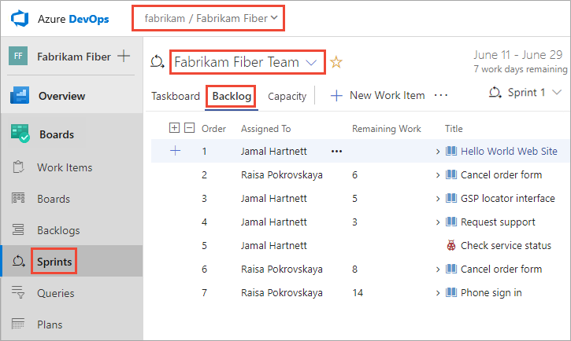

# 5. Share your sprint plan

[!INCLUDE [version-lt-eq-azure-devops](../../includes/version-lt-eq-azure-devops.md)] 
 

Once you complete your sprint plan, sharing it with your team and organization is simple. Stakeholders with project access can view the sprint plan by accessing the URL of your sprint backlog page. Additionally, you can distribute the plan via email or by printing a copy to ensure everyone stays informed and aligned.

## Open a sprint backlog for a team 

::: moniker range=">= azure-devops-2020"

1. From your web browser, open your product backlog. (1) Check that you've selected the right project, (2) choose **Boards>Sprints**, (3) select the correct team from the team selector menu, and lastly (4), choose **Backlog**. 

    > [!div class="mx-imgBorder"]  
    > 

   To choose another team, open the selector and select a different team or choose the :::image type="icon" source="../../media/icons/home-icon.png" border="false"::: **Browse all sprints** option. Or, you can enter a keyword in the search box to filter the list of team backlogs for the project.

   > [!div class="mx-imgBorder"]  
   >   

2. To choose a different sprint than the one shown, open the sprint selector and choose the sprint you want. 

	> [!div class="mx-imgBorder"]  
	> 

	The system lists only those sprints that have been selected for the current team focus. If you don't see the sprints you want listed, then choose **New Sprint** from the menu, and then choose **Select existing iteration**. For more information, see [Define iteration (sprint) paths](../../organizations/settings/set-iteration-paths-sprints.md). 

::: moniker-end

::: moniker range="azure-devops-2019"

1. From your web browser, open your product backlog. (1) Check that you've selected the right project, (2) choose **Boards>Sprints**, (3) select the correct team from the team selector menu, and lastly (4), choose **Backlog**. 

1. 

   To choose another team, open the selector and select a different team or choose the :::image type="icon" source="../../media/icons/home-icon.png" border="false"::: **Browse all sprints** option. Or, you can enter a keyword in the search box to filter the list of team backlogs for the project.

   > [!div class="mx-imgBorder"]  
   >   

2. To choose a different sprint than the one shown, open the sprint selector and choose the sprint you want. 

	> [!div class="mx-imgBorder"]  
	> 

	The system lists only those sprints that have been selected for the current team focus. If you don't see the sprints you want listed, then choose **New Sprint** from the menu, and then choose **Select existing iteration**. For more information, see [Define iteration (sprint) paths](../../organizations/settings/set-iteration-paths-sprints.md). 

::: moniker-end

## Create query for your sprint plan 

::: moniker range=">= azure-devops-2019"

1. (Optional) To choose which columns should display and in what order, choose the  :::image type="icon" source="../../media/icons/actions-icon.png" border="false"::: actions icon and select **Column options**. For more information, see [Change column options](../backlogs/set-column-options.md). 

	> [!div class="mx-imgBorder"]  
	>  

1. To email your sprint plan, create and save the query for the sprint backlog. 

	> [!div class="mx-imgBorder"]  
	>  

2. Then, open the query and choose the email icon. 

   > [!div class="mx-imgBorder"]  
   >  

3. In the form that appears, enter the name(s) of valid users (ones who have access to the project). 

   > [!IMPORTANT]     
   > You can only send the email to individual address for a project member that is recognized by the system. Adding a team group or security group to the to line isn't supported. If you add an email account that the system doesn't recognize, you receive a message that one or more recipients of your email don't have permissions to read the mailed work items.  

::: moniker-end

Or, you can select all the items in the list, choose **Copy as HTML**, and paste the formatted list into an email form or Word document. See [Copy a list of work items](../backlogs/copy-clone-work-items.md#copy-a-list-of-work-items). 

## Next step
> [!div class="nextstepaction"]
> [6. Update the taskboard](task-board.md) 

## Related articles

- [Send email with work items](../work-items/email-work-items.md)
