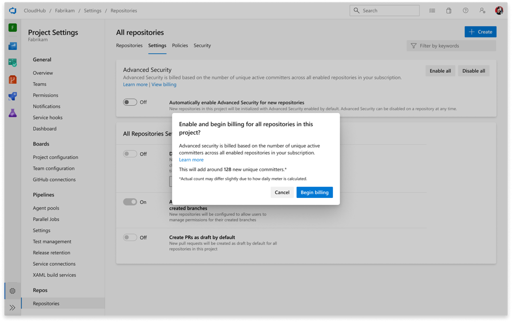
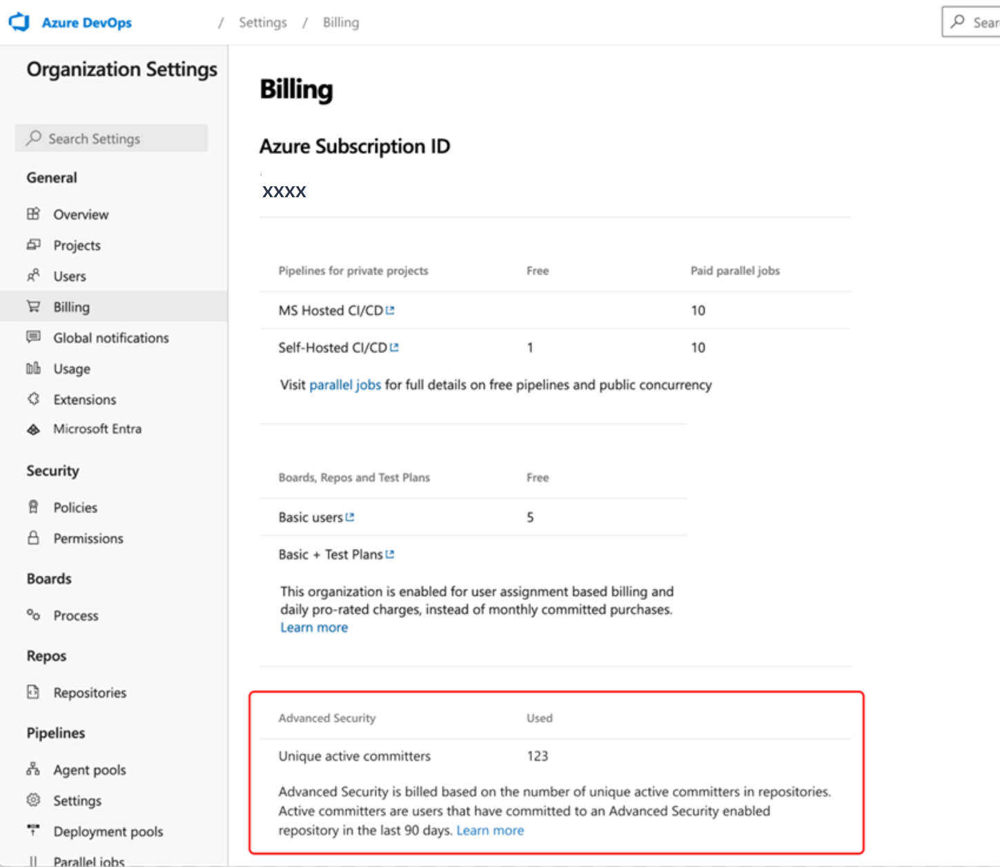

#  Advanced Security billing

To access results and use [GitHub Advanced Security for Azure DevOps](configure-github-advanced-security-features.md) features, you need a license. Each active committer to at least one repository with Advanced Security enabled consumes one license and [costs $49 per month per active committer](https://azure.microsoft.com/products/devops/github-advanced-security#pricing). A committer is considered active if they are present in a push made within the last 90 days, regardless of when they originally committed. 

Advanced Security is billed directly to the Azure subscription associated with your Azure DevOps organization. The bill is metered monthly. Daily charges emit to your Azure subscription based off of the total number of active committers per day across your organizations.

Active committers are deduplicated across an Azure subscription. Users can contribute to multiple repositories or organizations and will not be counted more than once, as long as those organizations are associated with the same Azure subscription. 

[!INCLUDE [GitHub Advanced Security for Azure DevOps is different from GitHub Advanced Security.](includes/github-advanced-security.md)]

### Active committer count for Advanced Security 

Total active committers are the number of committers who contributed to at least one repository with Advanced Security enabled. For each pushed change, any valid identity that contributed to that change is considered an active committer, even if the commit was made before the 90-day span. Regardless of their Azure DevOps access level, they must be a member of your Azure DevOps organization.

Prior to enabling Advanced Security for your organization, project, or repository, you can see an estimate of the number of active committers you may be charged for. 

You can find the exact number of consumed licenses (active committer count in Advanced Security-enabled repositories) for Advanced Security under **Organization Settings > Billing**. This is the number of active committers as measured for the previous day.

If you disable Advanced Security for all repositories in your organization, the active committer estimate disappears but you can watch your billing on your Azure subscription in the Azure portal.

### Understanding active committer count 
Use the following table for an example of how active committers and your potential bill may change over time.

| Date | Events during the month | Total active committers |
| ---------- | ----------- | ------ |
| March 1 | A project collection admin enables Advanced Security for the Fabrikam repository. Fabrikam has 30 active committers over the past 90 days. | **30** |
| March 19 | A PCA disables Advanced Security for the Fabrikam repository. Moving forward, the active committers from Fabrikam are no longer charged for.| 30 - 30 = **0** |
| July 15 | A PCA re-enables Advanced Security for Fabrikam. Fabrikam has 20 active committers over the past 90 days now. | **20** |
| August 1 | A PCA enables Advanced Security for a second repository, AdventureWorks. In the last 90 days, 30 developers committed to that repository. 10 of those developers also committed to Fabrikam and don't consume more licenses. | 20 + 20 = **40** |

